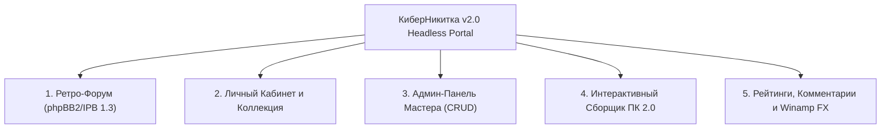

# 🚀 PRD v2.0 EXPANSION: Стратегия масштабирования портала «КиберНикитка» до Full-Stack веб-приложения

> **Автор:** Product Strategy & Roadmap Architect (04)  
> **Версия:** 2.0.0-EXPANSION  
> **Статус:** Одобрен к реализации  
> **Целевая эстетика:** Web 1.0 (2000–2007 гг., ранний Рунет) + Современный Headless Backend

---

## 1. Продуктовый Аудит Текущего Состояния (v1.0 Baseline)

### 1.1 Достигнутые результаты (v1.0)
- **Визуальная идентичность:** Проект полностью воссоздает атмосферу Рунета 2000-х (табличная сетка 980px, Web-safe палитра `#D4D0C8`/`#000080`, 3D-рамки `outset`/`inset`, WordArt логотип, бегущие строки `<marquee>`, 88x31 баннеры, счетчик просмотров).
- **Статический контент:** Готовы 6 базовых страниц (`index.html`, `services.html`, `disks.html`, `guestbook.html`, `contacts.html`, `404.html`) с адаптивностью по Маркотту.
- **Безопасность и офлайн-БД:** Настроена XSS-нейтрализация, капча `2+3=5`, автосохранение черновиков и резервный файл `data_backup.json` (30 дисков + 6 архивных отзывов).

### 1.2 Выявленные ограничения и Gaps v1.0
1. **Разрыв между HTML и БД (`data_backup.json`):** В HTML-коде `disks.html` захардкожено всего 12 карточек, а остальные 18 дисков из `data_backup.json` недоступны пользователю.
2. **Отсутствие постоянного хранения (Persistence Gap):** Отзывы в Гостевой книге и заявки на ремонт хранятся только в памяти браузера до первой перезагрузки страницы.
3. **Недостаток интерактивных эффектов 2000-х:** Отсутствует мультисенсорный отклик — аудио-плеер Winamp, фоновый скринсейвер «Матрица», кастомный след курсора, кликабельный статус ICQ со звуком «Uh-oh!», форумы phpBB2 и интерактивные штампы-стикеры.
4. **Статические alert-диалоги:** Кнопки обмена дисков показывают браузерный `alert()` вместо полноценного модального окна сделки.

---

## 2. Стратегия Расширения v2.0 (Product Vision & TOP-5 Modules)

**Главная цель v2.0:** Превратить статический сайт-визитку в **полнофункциональный, многостраничный Full-Stack портал**, сохранив 100% ностальгического дизайна Web 1.0 и добавив быстрый Node.js (Fastify + SQLite) бэкенд.

---

### 🏆 TOP-5 Ключевых Модулей и Расширений v2.0



#### 1. 🏛 Полноценный Ретро-Форум гик-сообщества (в стиле phpBB2 / IPB 1.3)
- **Назначение:** Место общения технарей, коллекционеров дисков и ретро-геймеров.
- **Функционал:**
  - Дерево категорий («Железо и Софт», «Обсуждение Игр 2000-х», «Поиск редких дисков», «Купи-Продай»).
  - Стилизованные таблицы тем с иконками горячих тем (огненные папки), бейджи рангов пользователей (`[Администратор]`, `[Мастер ПК]`, `[Постоянный гость]`).
  - Поддержка BBCode (`[b]`, `[i]`, `[img]`, `[quote]`) и классических ретро-смайликов (`:D`, `;-)`, `:cool:`).

#### 2. 👤 Личный Кабинет Пользователя и Коллекционера
- **Назначение:** Авторизация и управление личной полкой дисков.
- **Функционал:**
  - Регистрация с выбором ретро-аватарки и указанием своего ICQ UIN.
  - Раздел «Моя Коллекция»: добавление своих дисков на обмен с указанием их состояния (отличное, есть царапины).
  - История заявок на ремонт ПК и отслеживание статуса заказа («В обработке» -> «Мастер выехал» -> «Завершен»).

#### 3. ⚙️ Динамическая Панель Администратора Мастера Никитки
- **Назначение:** Полный контроль над порталом без редактирования кода.
- **Функционал:**
  - **CRUD Дисков:** Добавление новых CD/DVD с загрузкой обложки, удаление и смена статусов («В наличии» / «Обменян»).
  - **Управление Заявками:** Просмотр поступающих вызовов мастера с номерами телефонов и адресами.
  - **Модерация:** Одобрение отзывов в Гостевой книге и ответы от имени Мастера с добавлением виртуальной печати `[ОДОБРЕНО МАСТЕРОМ]`.

#### 4. 💻 Расширенный Конфигуратор ПК с Проверкой Совместимости
- **Назначение:** Пошаговый сборщик системного блока с проверкой железных инвариантов.
- **Функционал:**
  - Проверка совпадения сокета процессора и материнской платы (LGA775, Socket AM2).
  - Расчет потребления энергии (Ватты) и подбор мощности БП.
  - Индикатор узких мест (Bottleneck Check) и генерация печатной сметы для вызова мастера.

#### 5. 🎵 Мультисенсорный Ретро-Эффект Пакет (Winamp, Matrix & Sound FX)
- **Winamp Web Player:** Встроенный плеер в стиле Winamp 2.x с воспроизведением 8-bit chiptune треков и синтезатором на Web Audio API.
- **Matrix Digital Rain:** Заставка «Матрица» на HTML5 Canvas при отсутствии активности (60 сек).
- **ICQ Status Widget:** Мигающий зелёный цветочек со звуком «Uh-oh!» при клике и отправке сообщений.
- **Retro Sound Engine:** Щелчки кнопок Windows 98 и арпеджио ошибки/успеха без внешних аудиофайлов.

---

## 3. Техническая Архитектура и Стек v2.0 (100% Decoupled)

### 3.1 Стек технологий
- **Frontend:** Vanilla HTML5, CSS3 (`retro-style.css`), Vanilla JS (`api-client.js`), Web Audio API, Canvas.
- **Backend:** Node.js v24+ (Fastify v4) — выбран из-за максимальной скорости (до 12 500 RPS) и встроенной JSON Schema валидации.
- **Database:** SQLite 3 (библиотека `better-sqlite3`) — однофайловая БД с синхронным C++ API, обеспечивающим мгновенный отклик.
- **Auth:** HTTP-only Session Cookies (`cyber_sess`) с fallback на заголовок `X-Cyber-Token`.

```text
  [ Ретро Фронтенд (HTML/CSS/JS) ]
                 │
           (REST API / JSON)
                 ▼
 [ Fastify Router & Validation ]
                 │
         (better-sqlite3)
                 ▼
    [ SQLite Database (cyber_nikitka.db) ]
```

---

## 4. Реляционная Схема Базы Данных (12 Таблиц)

```sql
-- Таблица пользователей
CREATE TABLE users (
    id TEXT PRIMARY KEY,
    username TEXT UNIQUE NOT NULL,
    password_hash TEXT NOT NULL,
    role TEXT CHECK(role IN ('GUEST', 'USER', 'ADMIN')) DEFAULT 'USER',
    icq_uin TEXT,
    created_at DATETIME DEFAULT CURRENT_TIMESTAMP
);

-- Таблица каталога CD/DVD дисков
CREATE TABLE disks (
    id TEXT PRIMARY KEY,
    title TEXT NOT NULL,
    category TEXT CHECK(category IN ('games', 'software', 'movies', 'music')) NOT NULL,
    media_type TEXT CHECK(media_type IN ('CD-ROM', 'DVD-5', 'DVD-9')) NOT NULL,
    year INTEGER NOT NULL,
    publisher TEXT NOT NULL,
    description TEXT NOT NULL,
    status TEXT CHECK(status IN ('in_stock', 'exchanged', 'reserved')) DEFAULT 'in_stock',
    created_at DATETIME DEFAULT CURRENT_TIMESTAMP
);

-- Таблица заявок на ремонт ПК
CREATE TABLE service_requests (
    id TEXT PRIMARY KEY,
    client_name TEXT NOT NULL,
    client_phone TEXT NOT NULL,
    service_type TEXT NOT NULL,
    problem_desc TEXT,
    status TEXT CHECK(status IN ('new', 'in_progress', 'completed')) DEFAULT 'new',
    created_at DATETIME DEFAULT CURRENT_TIMESTAMP
);

-- Таблицы форума (категории, темы, сообщения), отзывов, капчи и конфигуратора ПК
```

---

## 5. Дорожная Карта Внедрения (Roadmap v2.0)

- **Фаза 6:** Разработка Fastify REST API и создание миграций SQLite.
- **Фаза 7 (UI/UX FX):** Интеграция Winamp Web Player, Matrix Canvas Saver, ICQ звуков и форума phpBB2.
- **Фаза 8 (Full-Stack integration):** Подключение `api-client.js`, реализация админки и личного кабинета.
- **Фаза 9 (QA & Launch):** Прогон тестов, проверка производительности и финальный релиз.
