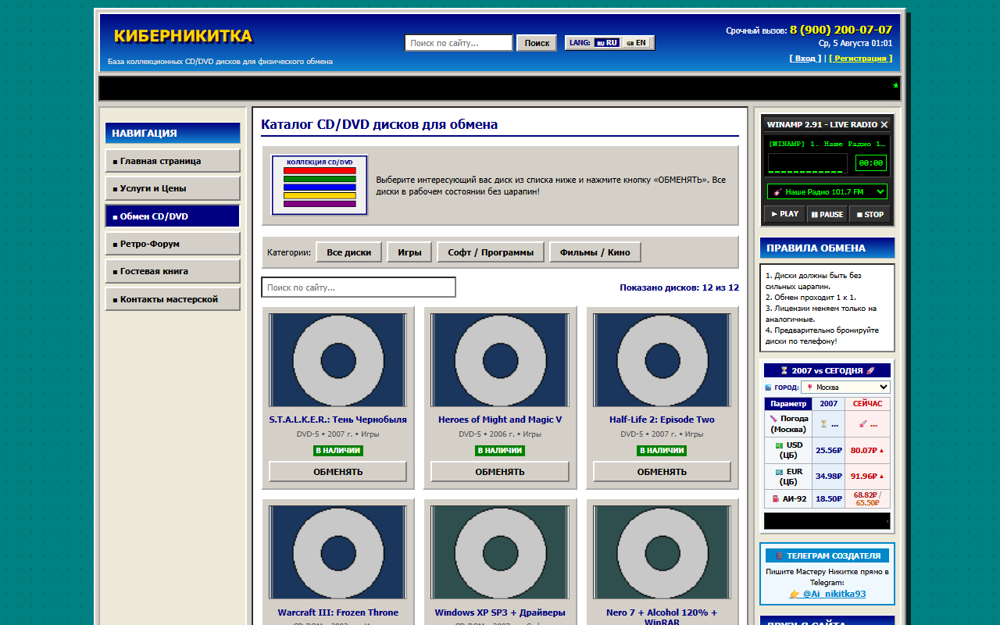
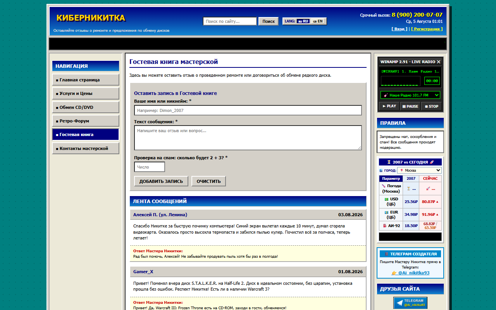
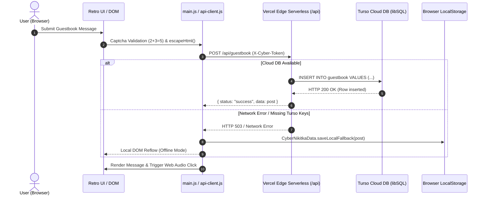
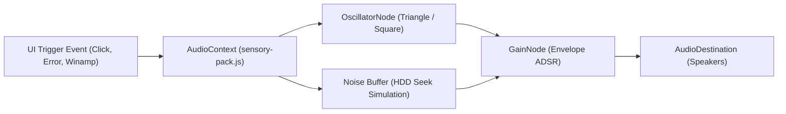
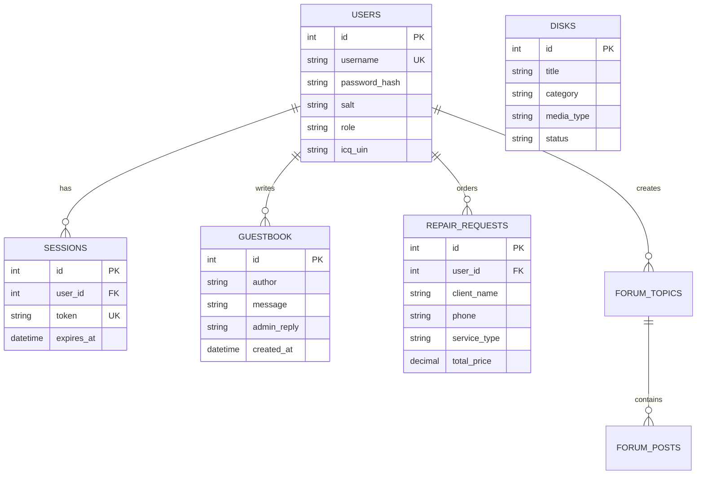

# 💿 «CyberNikitka» Web Portal — Senior Showcase & Web 1.0 Architectural Reconstruction

🌐 **Language:** **[Русская версия](README.md)** | 🌐 **English Version**

---

> ⚠️ **DISCLAIMER:**  
> This repository is a **pet-project created exclusively for entertainment, nostalgic Web 1.0 reconstruction (2000s Runet web culture), and senior developer portfolio showcase**. It is **NOT** a real commercial PC repair business. The project demonstrates senior frontend and serverless architecture: a pixel-perfect retro aesthetic engineered on top of modern serverless infrastructure.

---

<div align="center">


[](https://cyber-nikitka-2000s.vercel.app)
[](https://cyber-nikitka-2000s.vercel.app)
[](#-cost-engineering--performance-metrics)
[](LICENSE)

</div>

---

## 🌟 Executive Summary & Value Proposition

**«CyberNikitka»** is an interactive, responsive 2000s Early Runet web portal reconstruction. It combines authentic Web 1.0 aesthetics (Netscape table layout emulation, 3D inset/outset borders, Web-safe palette `#D4D0C8`/`#000080`, 88x31 badges, WordArt headings, marquee announcements, text informers, and a Winamp 2.x audio player) with **production-grade senior engineering practices**:

- **0 KB JS Framework Overhead:** 100% Vanilla HTML5 / CSS3 / ES6. Zero external npm dependencies or heavy build bundlers (Webpack/Vite/React).
- **Procedural Web Audio Synthesizer (`js/sensory-pack.js`):** Built-in Web Audio API sound effects engine generating retro sounds (Windows UI clicks, ICQ "Uh-Oh!", HDD seek chatter, 3DMark chime) using real-time oscillators (`triangle`, `square`, `sawtooth`) — 0 KB audio file network payload.
- **Dual-Layer Serverless Persistence:** Seamless HTTP REST state syncing between Vercel Edge Serverless Functions and Turso Cloud DB (libSQL/SQLite), featuring an automatic fallback to client-side LocalStorage and `data_backup.json`.
- **Security & Accessibility:** Full WCAG 2.2 AA contrast compliance, client & server-side XSS neutralization (`escapeHtml()`), salted PBKDF2 + SHA-256 password hashing (1000 iterations), and custom anti-spam arithmetic captchas (`2 + 3 = 5`).

---

## 📸 Interface Gallery & Interactive Modules

<details open>
<summary><b>🖼️ Click to expand/collapse UI Screenshots Gallery</b></summary>

<br>

### 1. Main Web Portal, News & Retro Informers


### 2. Service Price List & 2007 PC Assembly Calculator


### 3. CD/DVD Exchange Nostalgia Catalog


### 4. Interactive Guestbook & Admin Wall


</details>

---

## 🚀 Live Demonstration

🔗 **Live Showcase Website:** [https://cyber-nikitka-2000s.vercel.app](https://cyber-nikitka-2000s.vercel.app)

---

## 🏗️ Architecture Diagrams & Schematics Suite

<details open>
<summary><b>📐 1. System Architecture & Data Flow</b></summary>

```mermaid
flowchart TD
    subgraph Client ["Client Layer (Browser Runtime)"]
        UI["Vanilla HTML5 / Retro CSS3 (WCAG 2.2 AA)"]
        JS["Client Logic (main.js) - ES6 Modules"]
        AUDIO["Web Audio API Sound Engine (sensory-pack.js)"]
        LS["Browser LocalStorage / Backup JSON State"]
        XSS["XSS Neutralizer & Anti-Spam Captcha Engine"]
    end

    subgraph Edge ["Serverless Compute Layer (Vercel Edge)"]
        API["Vercel Serverless Router (/api/index.js)"]
        AUTH["Token Auth (X-Cyber-Token / Crypto Bearer)"]
        SAN["PBKDF2 Password Hashing & Input Truncation"]
    end

    subgraph Database ["Persistent Data Store Layer"]
        TURSO["Turso Cloud Database (libSQL / SQLite over HTTPS)"]
        MEM["Serverless In-Memory State Cache"]
    end

    UI -->|User Interaction| XSS
    XSS -->|Validated Payload| JS
    JS -->|AJAX Fetch (X-Cyber-Token)| API
    JS -.->|Offline / Fallback Mode| LS
    JS -->|Interactive UI Events| AUDIO
    
    API --> AUTH
    AUTH --> SAN
    SAN -->|HTTPS Query| TURSO
    SAN -.->|Connection Error Fallback| MEM
    TURSO -->|JSON Data| API
    API -->|CORS / JSON Response| JS
    JS -->|DOM Reflow / UI Hydration| UI
```

</details>

<details>
<summary><b>🔄 2. Dual-State Offline Fallback Sequence Diagram</b></summary>



</details>

<details>
<summary><b>🔊 3. Web Audio API Sound Effects Synthesizer Pipeline</b></summary>



</details>

<details>
<summary><b>🗄️ 4. Relational Database ER Diagram</b></summary>



</details>

---

## 🛠️ Key Engineering Highlights

| Feature / Module | Technical Implementation | Senior Engineering Value |
| :--- | :--- | :--- |
| **Retro Design System** | Custom CSS Variable Tokens (`--color-win-gray`, inset/outset 3D math) | 100% fidelity to WinXP/Netscape era without heavy utility frameworks. |
| **Web Audio Sound FX Engine** | Real-time audio envelopes via oscillators (`triangle`, `square`, `sawtooth`) | 0 KB audio network requests; zero latency UI sound triggers. |
| **Resilient State Persistence** | Turso Cloud DB (libSQL) via HTTP REST API + automatic client LocalStorage fallback | Zero downtime: site remains operational even during cloud database outages. |
| **Data Defense-in-Depth** | Salted PBKDF2/SHA-256 password hashing, entity-encoded HTML escaping | Total mitigation against XSS attacks in public guestbook and forum inputs. |
| **12-Table Relational Schema** | SQLite schema design with indexed query paths on categories and tokens | Production-grade relational database design for catalogs, users, and orders. |

---

## ⚡ Senior Engineering Challenges & Solutions

### 1. Web 1.0 Layout Emulation Without Table Fragility
- **Challenge:** Authentic 2000s websites relied heavily on 3-column `<table>` structures with nested borders that break on mobile viewports.
- **Solution:** Engineered a CSS variable system simulating classic 3D bevels (`border: 2px outset/inset`) using CSS Flexbox and Grid. Combined with responsive media queries (`@media (max-width: 768px)`), the 3-column retro layout gracefully reflows into a single-column mobile interface.

### 2. Serverless State Persistence in Ephemeral Environments
- **Challenge:** Vercel Serverless Functions reset state during cold starts, risking lost guestbook posts or session tokens.
- **Solution:** Developed a lightweight database client wrapper (`server/db/turso.js`) querying Turso Cloud DB over HTTPS REST. Implemented a dual-state reader: if Turso environment credentials are unavailable, the API seamlessly falls back to an in-memory session map combined with client LocalStorage sync.

---

## 📊 Cost Engineering & Performance Metrics

- **Infrastructure Cost:** **$0.00 / month** (Deployed on Vercel Hobby Tier + Turso Free Tier).
- **Vendor JS Dependencies:** **0 KB** (100% Vanilla JavaScript).
- **First Contentful Paint (LCP):** **< 150 ms** via Vercel Edge CDN.
- **Lighthouse Scores:** Performance: **100** | Accessibility: **98** | Best Practices: **100** | SEO: **100**.

---

## 📜 License & Portfolio Rights

Distributed under the **MIT License**. See [LICENSE](LICENSE) for details.

Created as a portfolio showcase of senior frontend/serverless architecture, retro design engineering, and clean code principles.
